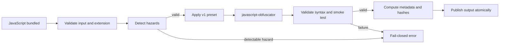
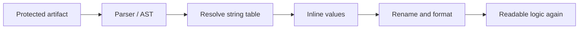

# js-condom

Build-time offline wrapper around `javascript-obfuscator` with a versioned preset, semantic
validation, and reproducible metadata.

This tool is an **operational wrapper**. It standardizes obfuscation defaults, validates supported
JavaScript subsets, and produces auditable artifacts. It is **not** a security boundary and does
**not** promise irreversibility, anti-LLM resistance, or measurable recovery cost.

## Project context and direction

We are building a build-time protection layer that runs locally and offline on top of a qualified
open-source engine. The MVP focuses on a single bundled JavaScript file and provides an API, a CLI,
and a versioned preset with consistent behavior.

### Why we are building it

The goal is to make protection predictable and auditable for teams producing JavaScript artifacts:

- reduce divergent project decisions through controlled defaults;
- preserve the semantics of the supported JavaScript subset;
- enable reproducible builds when a seed is fixed;
- record versions, configuration, seed, and hashes for diagnostics and audits;
- fail explicitly on incompatible inputs without publishing partial artifacts.

Previous investigation found insufficient evidence to promise resistance against automated
deobfuscation or LLMs. The expected outcome of this phase is therefore operational reliability, not
irreversibility. Any future claim about recovery cost must be measured in a separate adversarial
experiment with its own protocol and evidence.

### Expected MVP outcome

At the end of this phase, the project should provide:

1. a stable `protect(sourceCode, options)` function;
2. the `js-condom protect input.js --output protected.js` command for `.js`, `.mjs`, and `.cjs` files;
3. semantically equivalent output for officially supported fixtures;
4. reproducible bytes and hashes with a fixed seed;
5. enough metadata to reproduce and investigate a build;
6. structured errors, fail-closed behavior, and offline execution without telemetry;
7. CI and documentation for requalifying the engine before any upgrade.

Directories, source maps, bundler plugins, TypeScript/JSX, and new engines remain outside the MVP
and require their own decisions and specifications.

### Protection flow



## Recommended usage

The typical workflow is:

1. generate and bundle the application JavaScript;
2. run `js-condom` on the final artifact;
3. store the protected code and report with the build record;
4. retain `seedUsed`, `presetVersion`, and hashes for reproduction or diagnostics.

### CLI

After installing dependencies, protect a single file:

```bash
npm ci
node src/cli/protect.js protect dist/app.js \
  --output dist/app.protected.js \
  --report dist/app.protected.json \
  --seed release-2026-08-09
```

For reproducible builds, keep the same seed, package version, engine version, and preset. For
independent builds, omit `--seed`; the effective seed is recorded in the report.

### API

Use the API when the build pipeline is already controlled by Node.js:

```js
import { readFile, writeFile } from 'node:fs/promises';
import { protect } from './src/core/protect.js';

const source = await readFile('dist/app.js', 'utf8');
const result = await protect(source, { seed: 'release-2026-08-09' });

await writeFile('dist/app.protected.js', result.code, 'utf8');
await writeFile('dist/app.protected.json', `${JSON.stringify(result.metadata, null, 2)}\n`);
```

`js-condom` rejects unknown options and inputs outside the supported subset. On error, the CLI
returns a non-zero exit code and writes a JSON object to stderr. No artifact should be treated as
published when the operation fails.

## What the wrapper adds

When used with the same version, preset, and seed, `js-condom` uses the same transformation engine
as `javascript-obfuscator`. The value comes from the surrounding process:

- a controlled preset instead of divergent project flags;
- recorded seed, versions, configuration, and hashes;
- hazard and output validation before publication;
- one contract shared by the API and CLI;
- atomic writes, conflict prevention, and structured errors;
- CI gates, auditing, and offline execution.

This improves predictability, reproduction, and diagnostics. It is not an additional encryption
layer or proof of resistance against deobfuscation, manual analysis, or LLMs.

## Output and deobfuscation example

Consider this input code:

```js
export function greet(name) {
  return 'Hello, ' + name + '!';
}
```

With the v1 preset and a fixed seed, the output contains hexadecimal names, a string table, and an
engine-generated decoder. A representative excerpt of the current output is:

```js
function _0x5e01(_0x2a5f9d, _0x308dc7) {
  var _0x385af2 = _0x385a();
  return _0x5e01 = function (_0x5e0181, _0xf0dbdc) {
    _0x5e0181 = _0x5e0181 - 0x1de;
    return _0x385af2[_0x5e0181];
  }, _0x5e01(_0x2a5f9d, _0x308dc7);
}

// tabela e bootstrap omitidos neste exemplo

export function greet(_0x49708f) {
  var _0x2969d5 = _0x5e01;
  return _0x2969d5(0x1e6) + _0x49708f + '!';
}
```

This format makes casual reading harder, but it does not permanently hide the logic. A typical
deobfuscation process can:

1. analisar o AST e localizar a tabela de strings;
2. executar ou avaliar estaticamente o decodificador;
3. substituir chamadas como `_0x2969d5(0x1e6)` pelo texto correspondente;
4. rename identifiers and reformat the code;
5. comparar o resultado com o comportamento do artefato original.

After these steps, the essential logic can return to a form close to:

```js
export function greet(name) {
  return 'Hello, ' + name + '!';
}
```



Therefore, `js-condom` is expected to make casual reading harder and standardize the build, not
prevent reverse engineering. Recoverability depends on the program, preset, engine, and tools used
by the analyst. This repository does not publish a recovery rate, recovery time, or advantage
against LLMs; any such number requires a separate, reproducible adversarial benchmark.

## Requirements

- Node.js **24 LTS** (verified in CI)

## Installation

```bash
npm ci
```

The CLI is exposed as `js-condom` via the package `bin` field.

## API

```js
import { protect } from './src/core/protect.js';

const { code, metadata } = await protect(sourceCode, { seed: 'optional-seed' });
```

### Options

| Option | Type | Description |
|--------|------|-------------|
| `seed` | `string` (optional) | When omitted, a random seed is generated and returned in metadata. When set, output bytes and hashes are reproducible for the same input, preset, and engine version. |

### Result

```js
{
  code: string,
  metadata: {
    toolVersion: string,
    engineVersion: string,   // qualified javascript-obfuscator version
    presetVersion: string,   // e.g. "1.0.0"
    seedUsed: string,
    inputSha256: string,
    outputSha256: string,
    configSha256: string,
  }
}
```

Unknown options are rejected with `INVALID_CONFIG`. The public API does not expose raw engine flags.

## CLI

Protect a single JavaScript file:

```bash
js-condom protect input.js --output protected.js
```

Supported extensions: `.js`, `.mjs`, `.cjs`.

Optional flags:

```bash
js-condom protect input.mjs --output out.mjs --report report.json --seed my-seed
```

- `--output` is required.
- `--report` writes JSON metadata atomically when provided.
- Errors are written to stderr as structured JSON; exit code is non-zero on failure.
- Output paths must not collide with the input or existing files (fail closed).

## Preset v1

The preset is versioned as a single unit (`presetVersion: 1.0.0`). It encapsulates approved
`javascript-obfuscator` options (compact output, string array, no self-defending, no dead-code
injection, etc.). Consumers cannot pass arbitrary engine flags.

Qualified engine: `javascript-obfuscator@4.1.0` (see `package.json` → `jsCondom`).

## Seed behavior

- **Fixed seed:** same input + preset + engine version → identical output bytes and hashes.
- **Omitted seed:** `seedUsed` in metadata contains the effective seed (not a secret).
- Seeds are for reproducibility and audit trails, not confidentiality.

## Engine requalification policy

Any change to the qualified engine version or preset requires:

1. Re-run the full semantic fixture matrix (`npm test`).
2. Update `jsCondom.qualifiedEngineVersion` and/or `presetVersion` in `package.json`.
3. Record new reference hashes in the [release checklist](docs/release-checklist.md).
4. Security review of dependency changes (`npm audit --audit-level=high`).

Do not ship engine or preset upgrades without completing the checklist.

## Limitations

- **Single file only** — no directories, source maps, or bundler plugins in v1.
- **JavaScript only** — no TypeScript, JSX, or TSX.
- **Supported subset** — exercised by the release fixture matrix (ESM/CJS, async/await, classes,
  closures, generators, optional chaining, private fields, exceptions).
- **Rejected hazards (when detectable):** `eval`, `with`, `Function` constructor, and
  `function.prototype.toString` dependencies on function references.
- **Best-effort detection** — dynamic patterns not visible to static analysis are documented
  limitations, not guarantees.
- **No browser runtime** — protection runs in Node.js at build time.
- **No network or telemetry** during protection.

## Privacy

Input and output remain in the local process. The tool does not send source code, metadata, or
artifacts to external services during protection.

## Development

```bash
npm run lint    # syntax check (node --check) on core/cli sources
npm test        # full test suite including offline boundary tests
npm audit --audit-level=high
```

See [docs/release-checklist.md](docs/release-checklist.md) before tagging a release.
